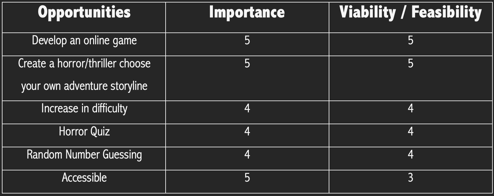

# THE EERIE MANSION

[View Live Website Here](https://the-eerie-mansion.herokuapp.com/)

# Table Of Contents

1. [Introduction](#introduction)
2. [User Experience](#user-experience)
    * [Site & User Goals](#site-&-user-goals)
    * [User Stories](#user-stories)    
3. [Development Planes](#development-planes) 
    * [Strategy](#strategy)
        * [Trade-off Equation](#trade-off-equation)
    * [Scope](#scope)
        * [Content Requirements](#content-requirements)
        * [Functional Specifications](#functional-specifications)
    * [Structure](#structure)
    * [Skeleton](#skeleton)
        * [Flow Logic](#flow-logic)
        * [Game Introduction](#game-introduction)
        * [Level One](#level-one)
        * [Level Two](#level-two)
        * [Level Three](#level-three)
    * [Surface](#surface)
        * [Imagery](#imagery)
        * [Features](#features)
4. [Technologies Used](#technologies-used)
5. [Search Engine Optimization](#search-engine-optimization)
6. [Bugs & Issues](#bugs-&-issues)
7. [Testing](#testing)
    * [Device Testing](#device-testing)
    * [Browser Testing](#browser-testing)
    * [Peer Review Testing](#peer-review-testing)
    * [User Stories Testing](#user-stories-testing)
8. [Validation](#validation)
    * [HTML Validator](#html-validator)
    * [CSS Validator](#css-validator)
    * [JavaScript Validator](#javascript-validator)
    * [Google Mobile-Freindly Test](#google-mobile-freindly-test)
    * [Lighthouse](#lighthouse)
9. [Deployment](#deployment)
    * [Repository Forking](#repository-forking)
    * [Repository Cloning](#repository-cloning)
10. [Credits](#credits)
11. [Bibliography](#Bibliography)

***
# Introduction

The Eerie Mansion is a text based; Choose Your Own Adventure game played directly in the Python terminal. The game is written from a second person perspective where the user assumes the role of the protagonist, making choices that determine their actions and the plots outcome. 

The Eerie Mansion implores a horror theme just in time for deployment before Halloween. The game is played on three different levels with difficulty and stakes increasing with each. It is unique as it has been combined with a horror movie quiz and random number guessing game, differentiating it from competitors.  

[Back To Top](#The-Eerie-Mansion)

***
# User Experience 
## Site & User Goals 
### Site Goals
-	Showcase a dynamic text based, horror themed, Choose Your Own Adventure Game
-	Create a fun and engaging game, with increase in difficulty 
-	Have a high standard of performance when played in the terminal 

### User Goals 
-	Play a fun and thrilling game just in time for Halloween.
-	Play a game that is not repetitive and increases in difficulty. 
-	Great accessibility when played in the terminal 

## User Stories 
### First Time Visitor Goals 
1.	As a First Time Visitor, I want to immediately understand the purpose of the game and what is on offer 
2.	As a First Time Visitor, I want to instinctively access the games components so I can understand the theme, controls and mechanics

### Returning Visitor Goals 
1.	As a Returning Visitor I want to play the game with a broad understanding of its storyline, controls and what is expected to win. 

2.	As a Returning Visitor I want to explore the different game paths and solutions. 

### Frequent User Goals 
1.	As a Frequent User I want to confidently progress through the game and have full understanding of how to win. 

2.	As a Frequent User I want to be able to access the site on different devices, as per my liking. 

3.	As a Frequent User I want to have fun and be motivated to play the game over, encouraging others to join. 

[Back To Top](#The-Eerie-Mansion)

***
# Development Planes 
## Strategy
The inception behind The Eerie Mansion was to develop a horror/thriller game just in time for Halloween. 
Therefore, it will leverage this time of year and the concept of Choose Your Own Adventure storyline to create a game as such. In doing so it aims to engage the user by creating a fun, multidimensional storyline to be enjoyed countless times. 

The website *needs* to enable the **User** to: 
-	Play a horror/thriller themed Choose Your Own Adventure Game 
-	Be reactive to user input 
-	Play a game that is engaging in terms of storyline and difficulty 

The website *needs* to enable the **Client** to: 
-	Develop an online game by creating a custom website that showcases a terminal for text-based quest
-	Create an air of horror/thriller adventure theme 
-	Be extremely accessible in terms of user input and output 

## Trade-off Equation: Importance VS Viability/Feasibility
A trade-off analysis was conducted in order to prioritise opportunities contingent on the business objectives and user needs. Said opportunities are ranked in terms of their importance versus their viability/feasibility. The table below illustrates this. 

As you can see all opportunities are important and manageable to implement. The only issue arises is with accessibility, since the game is text based and played in the terminal. Due to resource constraints, mainly experience this might prove slightly challenging. 

[Back To Top](#The-Eerie-Mansion)

***
# Scope
The Eerie Mansions initial release is to deploy a Minimal Viable Product in terms of content, accessibility, gameplay and functionality. Therefore, an agile methodology was used to develop a scope which was rooted in the strategy. 

As there are certain restrictions within the development of the game such as method of deployment and terminal confines this will be taken into account when defining the content requirements and functional specifications. 

## Content Requirements:
-	Theme indicative of horror/thriller genre by using text-based story telling.
-	Use imagery, making visuals more dynamic (terminal emojis).
-	Game that is responsive to user input and provides respective outputs. 
-	Contain visual ques for stylistic effect (e.g., transitions).
-	Choose Your Own Adventure gameplay that makes the user the protagonist. 
-	Horror Quiz.
-	Random Number Guessing game. 

## Functional Specifications:

-	Quick and seamless loading of the sites and its content. 
-	Fully operative and interactive game in terms of controls, level restart, game-over and expected user input. 
-	Site gives relevant feedback, validation and confirmation. 
-	Accessible. 

[Back To Top](#The-Eerie-Mansion)

***
# Structure
Due to the circumstances around deployment the game will be organised on a single page, with a terminal acting as the basis between user and application interaction. Consequently, the text-based content and visuals (emojis) will act as the main form of storytelling and design for the user. This will be discussed further down the readme document.  

[Back To Top](#The-Eerie-Mansion)

***
# Skeleton 
Since this The Eerie Mansion is a text-based game played in the terminal, the skeleton plane primarily focuses on the logic behind the game rather than visual elements such as illustrated in balsamic. This is especially important for a Choose Your Own Adventure Game where the logic is integral to the progression of the game. Any mistakes within the code could cause the entire game to crash or loop, rendering it useless. Flowchart was used to create diagrams to exemplify this. 

## Flow Logic 
The games logic consists of 4 main states. The first is the game into, the second is level 1, the third is level 2 and the fourth is level 3. 

### Game Introduction
This stage greets the user with the title of the game followed by a prompt for whether they want to play or not. Depending on the user input the game will act accordingly. If the user inputs anything incorrect then they game will loop to the initial prompt. This is followed by two sub states for whether the user wants to read the game rules followed by the plot. The same logic as above applies. When the user has completed the game introduction they are immediately taken to the first level. 

### Level One 
The first level is pure path choices with 30+ outcomes. The user is given three doors to choose from only of which 1 is the correct path. If the user chooses the wrong path, then they are looped back to the introduction of the level. If they choose the correct path they continue with the story and gameplay. This is where the bulk of the game story and theme is set, making the user comfortable with what is expected ahead.

### Level Two 
Level Two consist of the same path choice logic as previous except with the addition of a horror game quiz. To keep the game manageable and not too difficult the quiz is used for fun purposes meaning if they get a question wrong, they can still proceed to the next level. A game over was tried with the quiz but this proved to be too difficult to play. 

### Level Three 
The final level is a simple Random Number Generator Game. Therefore, the logic is straight forward. The user is expected to guess one correct number. If so they win the overall game, if not a game over is initiated meaning they would need to start from the game introduction. 

[Back To Top](#spacescape)

***
# Surface
The visual aspects of the game were text based and, in the terminal, meaning not a lot could be done out of those confines. The focal point used to convey the story was through text but some visual cues were implemented. 

## Imagery 
Most of the imagery used within the game were emojis in the "horror" or game related styles. This was done to break up the game visually as well as act as cues to the user of what has happened. In the first example the welcome screen uses skulls with the a message to start giving the user clues on what the game is about. 

The second example uses trailing dots as a visual cue for in game state changes. 

## Features
The game implements several features in order to function properly as well as develop an ambiance and theme to the overall gameplay. 

The first two examples illustrate to the user that they have chosen the wrong path meaning the level will restart from its respective introduction (level3 & level2)

The next two cues concerned the final level where the user either won ending the game, or loses ending the game as well but with two different outcomes. 

The following two gave the user the option to view some background information about the game (e.g., overarching story) or game rules or plot. 

The next feature allowed the user to completely skip the aforementioned two. This would be handy if an individual were playing multiple times making the game less repetitive. 

The next feature was to throw a looping error whenever the user did not input the expected character. This was especially important for the game’s progression. Since this is a text-based game, if this was not implemented the game would essentially crash causing for a bad user experience. 

Another important feature was the introductory input of asking the user whether they wanted to play or not. 

The final three features are arguably the most important for gameplay and progression. The first was the path choices which asked the user to choose the door between 1 – 3. This choice in turn dictated the game state and whether the user would progress or restart. 

The next was the quiz which was used as a fun break up to the game. Again this feature was left without much impact as this would have made the game too hard.  

Finally, the number guessing game which would decide whether the user won the overall game or not. Just like all other features the last game has user verification but in addition to a score system. If the user lost all 5 lives the game would start from the very beginingg. If not, the user would win. 

***
# Technologies Used 
- Python 
- PEP8
- Lighthouse 